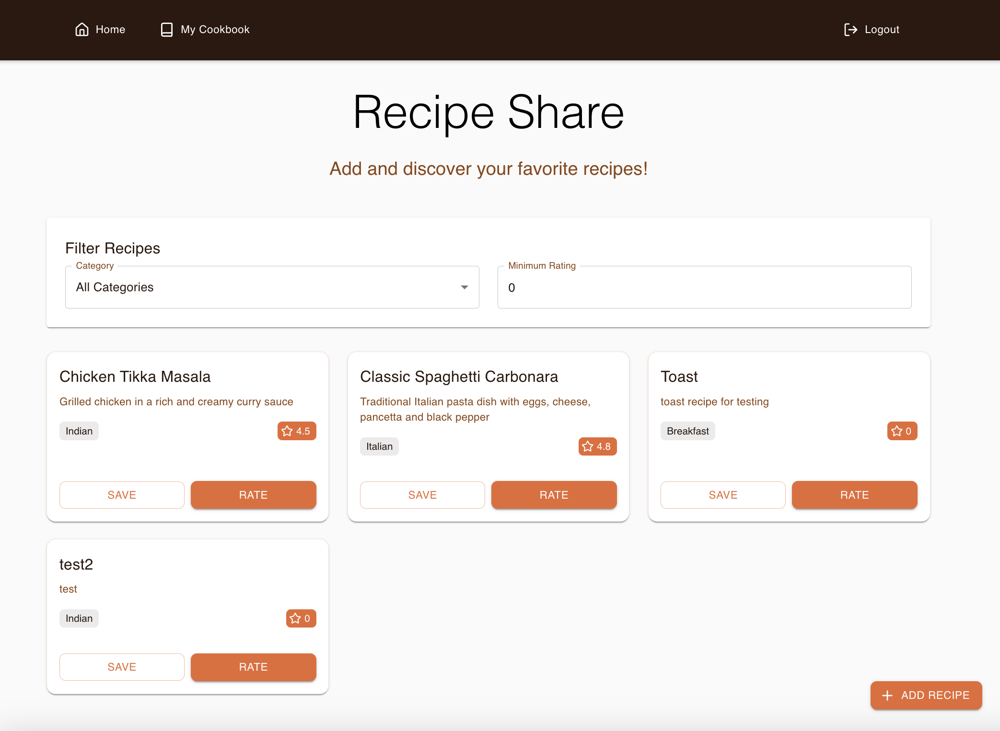

# Welcome to 🍳🧑🏻‍🍳Recipe Share 🍳🍝

RecipeShare is a web app for people to exchange recipes. Each user can create their own profile / cookbook by posting their own recipes, saving recipes they like, and view & rate other users’ recipes. 

## Pages / Features
### Log In 
Users can log in to the application via email and password.
Default username is: cathchow@seas.upenn.edu; Password: 3333

### Dashboard
he dashboard displays a list of recipes, which can be filtered by category and minimum rating. Users can also choose to save and rate each recipe

### Add Recipe
Users can add new recipes to the platform via a pop-up form.

### Cookbook (User Profile)
users can view and manage their own collection of saved recipes

### Log Out
users can log out of the application (lol). It then redirects the user to the log in page.

## Tech Stack
**Backend:** FastAPI (in Python)
**Frontend:** React.js
**Database:** MongoDB

## Start Scripts

In the frontend directory, run:

### `npm install`
### `npm start`

In the backend directory, run:

### `uvicorn main:app --reload --port 8000`

When running the backend, please incldue a .env file that contains two variables - `MONGO_ATLAS_URL` and `SECRET_KEY`
